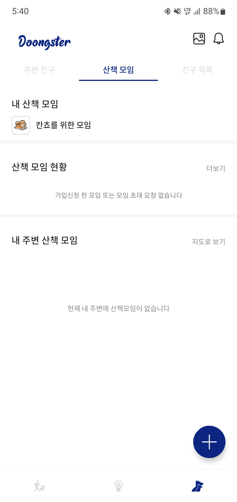

# 🙈 RecyclerView에서 여러개 data class 쓰는 방법!


출처[배달의 민족]

요즘 앱들을 보면 위와 같이 여러 타입의 데이터들로 구현이 되어있다.

그런데 RecyclerView를 동일한 뷰로 계속 그려왔거나 똑같은 data class 들로 구현을 해왔다

저런 식의 데이터 구현은 ScrollView 안에 넣어서 적은 데이터만 보여줘야하는데 만약 많은 데이터들을 보여줘야한다면???...

당연히 메모리 소비가 심해져서 앱이 버벅거리다 나중엔 메모리 릭이 나서 앱이 꺼지게 되는 상황도 나온다 (필자도 예전에 그랬다...🙉)


이번에 다시 여러 타입의 데이터와 뷰들을 가지고 개발을 해야하는 상황이 생겨서 잊어버리지 않기 위해 글을 쓴다.

일단 들어가기 전에 생각해두면 좋은 것

- 공통으로 사용할 ComponentData를 interface로 만들거다.
- ComponentData를 다른 형태의 data class에 상속시켜줄거다.
- 서버에서 따로 리스트 형식으로 들어오지 않은 것들을 묶어줄 Group data Class도 따로 만들어준다.
- 상속 받은 data class들을 하나에 List로 만들어서 RecyclerView Adapter에 넣어줄거다.

대충 이정도만 이해하고 들어가도 따라오다 보면 이해가 될 것입니다~ (그랬으면 좋겠다~🐒)

##### 일단 내가 만들 형식은 아래와 같다. ⬇️


사진을 보면 

- 공통된 타이틀
- 다른 UI의 item들
- 맨 하단은 계속해서 똑같은 데이터를 Grid형식으로 쭉 내려간다.

이런 형식의 list를 어떻게 만드는지 작성해볼거다.

### 1. 공통적으로 사용할 ComponentData 생성

자신이 몇 가지의 타입을 생성할 건지 생각을 하고 중간 TYPE_GROUP을 여러개 만들어주면 된다.

```kotlin
interface ComponentData {
    val id: Int
    val groupId: Int
    val viewType: Int

    override fun equals(other: Any?): Boolean

    companion object {
        const val VIEW_TYPE_TITLE = 0
        const val VIEW_TYPE_WALK_GROUP = 1
        const val VIEW_TYPE_WALK_GROUP_GROUP = 2
        const val VIEW_TYPE_AROUND_WALK_GROUP = 3
        const val NONE_TYPE_DATA = 500

        fun diffItemCallback() = object : DiffUtil.ItemCallback<ComponentData>() {
            override fun areItemsTheSame(oldItem: ComponentData, newItem: ComponentData): Boolean {
                return oldItem.id == newItem.id
            }

            override fun areContentsTheSame(
                oldItem: ComponentData,
                newItem: ComponentData
            ): Boolean {
                return oldItem == newItem
            }
        }
    }
}
```


### 2. Component Data 를 상속 받은 data Class 생성

```kotlin
// 제목 부분
data class TitleData(
    override val id: Int, override val groupId: Int,
    val title: String, val isDetail: Boolean, val detailText: String?
) : ComponentData {
    override val viewType: Int = VIEW_TYPE_TITLE
}

// 하단에 계속해서 보여줄 데이터
// 추후에 서버에서 받아온 데이터를 아래의 data class에 다시 넣어줌.
data class AroundGroupData(
    override val id: Int, override val groupId: Int,
    val data: WalkGroupsStatusResponse.Data
) : ComponentData {
    override val viewType: Int = VIEW_TYPE_AROUND_WALK_GROUP
}

// WalkGroupListData 안에 들어갈 세부 데이터
// 추후에 서버에서 받아온 데이터를 아래의 data class에 다시 넣어줌.
data class WalkGroupData(
    override val id: Int, override val groupId: Int,
    val data: WalkGroupsResponse.Data // <- 서버에서 내려주는 데이터
) : ComponentData {
    override val viewType: Int = VIEW_TYPE_WALK_GROUP
}

// WalkGroupData를 모아둔 List
// 추후에 데이터 병합 때 사용.
data class WalkGroupListData(
    override val id: Int, override val groupId: Int,
    val groupList: ArrayList<WalkGroupData> = ArrayList()
) : ComponentData {
    override val viewType: Int = VIEW_TYPE_WALK_GROUP_GROUP

    fun addGroupData(data: WalkGroupData) {
        groupList.add(data)
    }
}

// WalkGroupStatusListData 안에 들어갈 세부 데이터
// 추후에 서버에서 받아온 데이터를 아래의 data class에 다시 넣어줌.
data class WalkGroupStatusData(
    override val id: Int, override val groupId: Int,
    val data: WalkGroupsStatusResponse.Data // <- 서버에서 내려주는 데이터
) : ComponentData {
    override val viewType: Int = VIEW_TYPE_WALK_GROUP
}

// WalkGroupStatusData를 모아둔 List
// 추후에 데이터 병합 때 사용.
data class WalkGroupStatusListData(
    override val id: Int, override val groupId: Int,
    val groupList: ArrayList<WalkGroupStatusData> = ArrayList()
) : ComponentData {
    override val viewType: Int = VIEW_TYPE_WALK_GROUP_GROUP

    fun addGroupData(data: WalkGroupStatusData) {
        groupList.add(data)
    }
}

// 데이터가 없을 때 넣어줄 빈 리스트
data class NoneData(
    override val id: Int, override val groupId: Int,
    val groupList: ArrayList<WalkGroupStatusData> = ArrayList()
) : ComponentData {
    override val viewType: Int = NONE_TYPE_DATA
}

```


### 3. 각각의 다른 데이터 리스트들을 합쳐줄 코드

```kotlin
private fun dataCombine() {
        val list = mutableListOf<ComponentData>()

  			// title data는 기본 아이디를 0으로 설정.
        list.add(TitleData(0, 1, "내 산책 모임", false, ""))
        if (viewModel.getWalkGroup.value?.data?.data?.size == 0) {
         		// 데이터가 없다면 빈 리스트를 넣어서 null 값을 표시할 수 있게 빈 데이터 삽입.
            list.add(WalkGroupListData(1, 1)) 
        } else {
            viewModel.getWalkGroup.value?.data?.data?.forEach {
                list.add(WalkGroupData(it.id, 1, it))
            }
        }

        list.add(TitleData(0, 2, "산책 모임 현황", true, "더보기"))
        if (viewModel.getWalkGroupsStatusAll.value?.data?.data?.size == 0) {
         		// 데이터가 없다면 빈 리스트를 넣어서 null 값을 표시할 수 있게 빈 데이터 삽입.
            list.add(WalkGroupStatusListData(1, 2)) 
        } else {
            viewModel.getWalkGroupsStatusAll.value?.data?.data?.forEach {
                list.add(WalkGroupStatusData(it.id, 2, it))
            }
        }

        list.add(TitleData(0, 3, "내 주변 산책 모임", true, "지도로 보기"))
        if (viewModel.getWalkGroupsAround.value?.data?.data?.size == 0) {
         		// 데이터가 없다면 빈 리스트를 넣어서 null 값을 표시할 수 있게 빈 데이터 삽입.
            list.add(NoneData(100, 3))
        } else {
            viewModel.getWalkGroupsAround.value?.data?.data?.forEach {
                list.add(AroundGroupData(it.id, 3, it))
            }
        }

        val combineList = list.groupBy { it.groupId } // 그룹 아이디로 그룹화
            .map {
                it.key to it.value.sortedBy { item ->
                    item.id // 아이디로 순서 정렬
                }
            }
            .flatMap {
                mergeComponent(it.second) // 아래의 함수
            }

        walkGroupsComponentAdapter.submitList(combineList)
}

// list Data Class 안에 들어갈 데이터들을 찾아 주입.
private fun mergeComponent(list: List<ComponentData>): List<ComponentData> {
  val mergedList = ArrayList<ComponentData>()
  var groupComponent: ComponentData? = null
  for (componentData in list) {
    when (componentData) {
      is WalkGroupData -> {
        if (null == groupComponent) {
          groupComponent = WalkGroupListData(
            componentData.id, componentData.groupId
          )
        }

        if (groupComponent is WalkGroupListData) {
          groupComponent.addGroupData(componentData)
        }
      }

      is WalkGroupStatusData -> {
        if (null == groupComponent) {
          groupComponent = WalkGroupStatusListData(
            componentData.id, componentData.groupId
          )
        }

        if (groupComponent is WalkGroupStatusListData) {
          groupComponent.addGroupData(componentData)
        }
      }
      else -> mergedList.add(componentData)
    }
  }

  groupComponent?.let {
    mergedList.add(it)
  }

  return mergedList
}

```


### 4. Adapter 생성.

```kotlin
class WalkGroupsComponentAdapter() :
    ListAdapter<ComponentData, WalkGroupsBaseViewHolder>(ComponentData.diffItemCallback()) {

    constructor(dataList: List<ComponentData>) : this() {
        submitList(dataList)
    }

    override fun onCreateViewHolder(parent: ViewGroup, viewType: Int): WalkGroupsBaseViewHolder {
        val inflater = LayoutInflater.from(parent.context)
        return when (viewType) {
            VIEW_TYPE_TITLE -> TitleViewHolder(inflater, parent)
            VIEW_TYPE_WALK_GROUP -> WalkGroupBarViewHolder(inflater, parent)
            VIEW_TYPE_WALK_GROUP_GROUP -> WalkGroupListViewHolder(inflater, parent)
            VIEW_TYPE_AROUND_WALK_GROUP -> AroundGroupViewHolder(inflater, parent)
            else -> NoneViewHolder(inflater, parent)
        }
    }

    override fun onBindViewHolder(holder: WalkGroupsBaseViewHolder, position: Int) {
        holder.bind(getItem(position))
    }

    override fun getItemViewType(position: Int): Int {
        return currentList[position].viewType
    }
}
```

```kotlin
// WalkGroupsBaseViewHolder.kt

sealed class WalkGroupsBaseViewHolder( // 공통적으로 사용할 ViewHolder / 각 ViewHolder에 상속될 예정
    @LayoutRes layoutId: Int, inflater: LayoutInflater, parent: ViewGroup
) : RecyclerView.ViewHolder(inflater.inflate(layoutId, parent, false)) {

    abstract fun bind(data: ComponentData)
}

class TitleViewHolder(inflater: LayoutInflater, parent: ViewGroup) :
    WalkGroupsBaseViewHolder(R.layout.item_walk_group_title, inflater, parent) {
    private val binding: ItemWalkGroupTitleBinding = ItemWalkGroupTitleBinding.bind(itemView)

    override fun bind(data: ComponentData) {
        if (data is TitleData) {
            binding.title = data.title
            binding.isDetail = data.isDetail
            binding.detailText = data.detailText
        }
    }
}

class WalkGroupBarViewHolder(inflater: LayoutInflater, parent: ViewGroup) :
    WalkGroupsBaseViewHolder(R.layout.item_walk_group_bar, inflater, parent) {
    private val binding: ItemWalkGroupBarBinding = ItemWalkGroupBarBinding.bind(itemView)

    override fun bind(data: ComponentData) {
        if (data is WalkGroupData) {
            binding.title = data.data.title
        }
        if (data is WalkGroupStatusData) {
            binding.title = data.data.title
        }
    }
}

class WalkGroupListViewHolder(inflater: LayoutInflater, parent: ViewGroup) :
    WalkGroupsBaseViewHolder(R.layout.item_walk_group, inflater, parent) {
    private val binding: ItemWalkGroupBinding = ItemWalkGroupBinding.bind(itemView)

    init {
        binding.recyclerView2.apply {
            layoutManager = LinearLayoutManager(itemView.context, RecyclerView.VERTICAL, false)
            isNestedScrollingEnabled = false
        }
    }

    override fun bind(data: ComponentData) {
        if (data is WalkGroupListData) {
            binding.recyclerView2.adapter = WalkGroupsComponentAdapter(data.groupList)
            binding.walkGroupListEmptyText.beVisibleIf(data.groupList.size == 0)
            if (data.groupList.size == 0) {
                binding.walkGroupListEmptyText.text =
                    binding.walkGroupListEmptyText.context.getString(R.string.walk_group_null)
            }
        }
        if (data is WalkGroupStatusListData) {
            binding.recyclerView2.adapter = WalkGroupsComponentAdapter(data.groupList)
            binding.walkGroupListEmptyText.beVisibleIf(data.groupList.size == 0)
            if (data.groupList.size == 0) {
                binding.walkGroupListEmptyText.text =
                    binding.walkGroupListEmptyText.context.getString(R.string.walk_group_status_null)
            }
        }
    }
}

class AroundGroupViewHolder(inflater: LayoutInflater, parent: ViewGroup) :
    WalkGroupsBaseViewHolder(R.layout.item_walk_group_grid, inflater, parent) {
    private val bnd: ItemWalkGroupGridBinding = ItemWalkGroupGridBinding.bind(itemView)

    override fun bind(data: ComponentData) {
        if (data is AroundGroupData) {
            bnd.groupTitle.text = data.data.title
        }
    }
}

class NoneViewHolder(inflater: LayoutInflater, parent: ViewGroup) :
    WalkGroupsBaseViewHolder(R.layout.item_walk_group_none, inflater, parent) {

    override fun bind(data: ComponentData) {}
}

```


### 5. RecyclerView 설정

계속 Linear 형식으로 내려가다 Grid형식으로 보여줘야하는 구간이기에 아래에 설정값 추가.

```kotlin
walkGroupRecyclerView.apply {
  layoutManager = GridLayoutManager(requireContext(), 2)
  .apply {
    spanSizeLookup = object : GridLayoutManager.SpanSizeLookup() {
      override fun getSpanSize(position: Int): Int {
        return when (walkGroupsComponentAdapter.getItemViewType(position)) {
          VIEW_TYPE_AROUND_WALK_GROUP -> 1
          else -> 2
        }
      }
    }
  }
  adapter = walkGroupsComponentAdapter
}.addItemDecoration(ComponentItemDecoration()) // <- grid 형식으로 들어갈 데이터들의 margin값 등 처리할 함수
// 만약 필요 없다면 제거해도 된다.
```

```kotlin
// ComponentItemDecoration()
class ComponentItemDecoration : RecyclerView.ItemDecoration() {

    override fun getItemOffsets(
        outRect: Rect,
        view: View,
        parent: RecyclerView,
        state: RecyclerView.State
    ) {
        if (null != parent.adapter) {
            val itemCount = parent.adapter!!.itemCount
            if (itemCount > 0) {
                val currentPosition = parent.getChildAdapterPosition(view)

                var spanCount = 0         // layoutManager 에 셋팅된 spanManager
                var itemSpanSize = 0      // 현재아이템의 spanSize
                var itemSpanRowIndex = 0  // 현재아이템의 rowIndex(e.g. spanCount=2, spanSize=1 인 경우 0, 1 가능)
                var spanGroupPosition = 0 // 현재아이템(==view) row position


                parent.layoutManager?.let {
                    if (it is GridLayoutManager) {
                        spanCount = it.spanCount
                        itemSpanSize = it.spanSizeLookup.getSpanSize(currentPosition)
                        itemSpanRowIndex =
                            it.spanSizeLookup.getSpanIndex(currentPosition, spanCount)
                        spanGroupPosition =
                            it.spanSizeLookup.getSpanGroupIndex(currentPosition, spanCount)


                        for (nextPosition in currentPosition until itemCount - 1) {
                            val nextSpanGroupIndex =
                                it.spanSizeLookup.getSpanGroupIndex(nextPosition, spanCount)
                            if (spanGroupPosition < nextSpanGroupIndex) {
                                break
                            }
                        }
                    }
                }

                // horizontal margins
                if (itemSpanSize == 1) {
                    if (itemSpanRowIndex == 0) {
                        outRect.left = 20.toDp
                        outRect.right = 10.toDp
                    } else {
                        outRect.left = 10.toDp
                        outRect.right = 20.toDp
                    }
                }

            }
        }
    }
}
```


위에와 같이 설정한다면 아래와 같은 결과물을 도출 시킬 수 있다.(아직 하단의 데이터는 서버에서 내려오지 않아 표시는 불가능 🤦‍♂️ / 추후에 이미지 변경 예정)




이 기능은 요즘 앱 추세에 부합하는 형식이므로 꼭 배웠어야하는 기능인데 정말 잘됐다.

추후에 또 이런 기능을 구현해야한다면 좀 더 깔끔하게 모듈화 시켜서 어느 곳에서도 가져다 쓸 수 있도록 구현할 예정~


[참고] : https://neopathos.medium.com/%EC%A1%B0%EA%B8%88-%EB%8D%94-%EB%B3%B5%EC%9E%A1%ED%95%9C-multi-viewholder-5575d2906cd7
