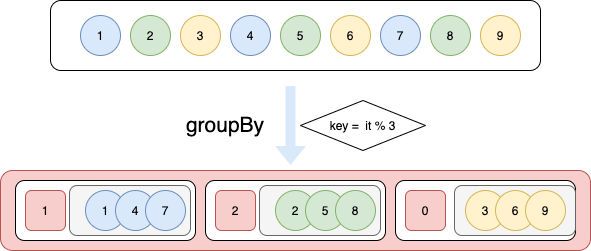
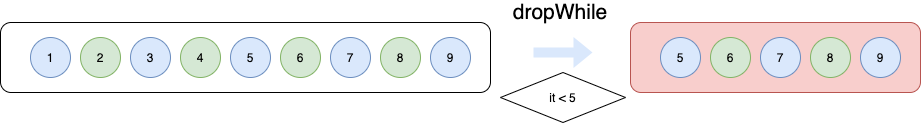
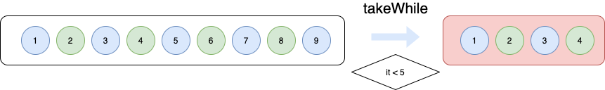
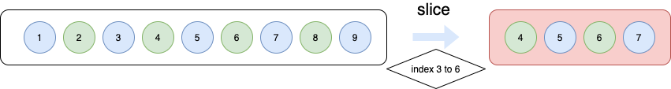

# groupBy, dropWhile, takeWhile, slice - Collections 함수 List를 쉽게 가공합시다 with Kotlin 🧶


우리는 같은 형태의 게시물들을 처리하고 가공한다.

그걸 필터를 통해 보고 싶은 것만 볼 수 있어야하고 여러 데이터들을 그룹화 시켜야하기도 한다.

이제 for문 forEach문으로 if 문으로 빼고 더하고는 그만하고 제공해주는 기능을 똑똑하게🧑🏻‍💻(난 바보야...) 써보자.

1. groupBy(그룹봐이)



(이미지를 보면 굉장히 이해하기 쉽다.)

내가 사용했던 예제도 같이 적어놓으려한다.

상황 : 회원들의 수업 현황이 내려오는데 그걸 **최신순으로 정렬** 후 해당 날짜의 수업은 **시간순으로 정렬**해야하는 상황이다.

```kotlin
// 주석으로 설명을 달아보도록!
val sortList = list.sortedByDescending { reservation -> //sortedByDescending -> 역순으로 정렬한다.
		reservation.startTime 
		// reservation.startTime = "2022-09-08T12:55:11.000.00Z"
    // string인 시간이라도 정렬이 가능하다.
	}.groupBy { // groupBy은 아래의 기준으로 그룹화한다.
		it.startTime.split("T")[0] // = "2022-09-08" 일단 날짜 순으로 그룹화.
	}.map {
		it.key to it.value.sortedBy { item ->
			// sortedBy -> 아래의 기준으로 정렬한다.
			item.startTime // = "2022-09-08T12:55:11.000.00Z"
		}
	}.flatMap {
  	// 필자는 key값(그룹화한 날짜)은 필요없고 value값(리스트)만 필요해서 flatMap을 사용했다.
		it.second
	}
```


2. dropWhile(드뢉와일~)



(그림만 보면 이해가 충분히 된다.)

상황 : **현재시간 기점**으로 일정들 중에 **제일 가까운 일정 최대 3개**만 보여줘야한다.

```kotlin
// 현재시간
val today = Date().format("yyyy-MM-dd'T'HH:mm:ss.SSS'Z'", Locale.KOREAN)

val sortList = list.dropWhile {
  // date = "2022-09-08" / startAt = "12:10:00" 형태로 내려와서 합쳐주는 상황으로 만듬
	today > it.date.replace("00:00:00", it.startAt) // 현재시간 > 일정시간 == true -> 리스트에서 제거
}.subList(0, if (sortList.size < 3) sortList.size else 3) // subList(startIndex, lastIndex)
// 리스트가 3개 이상이면 3개만, 3개 이하면 가지고 있는 개수만 보여주게 처리
```


3. takeWhile(텤와일~)



dropWhile이랑 반대로 true인 것을 가져간다. (취향것 사용하면 될 것 같다. 그러므로 예제 상황은 p.a.s.s~)

4. slice(넥! 슬라이스!)




슬라이스는 구간을 정해서 리스트를 가져온다.

```kotlin
// 위에 코드와 동일.
val today = Date().format("yyyy-MM-dd'T'HH:mm:ss.SSS'Z'", Locale.KOREAN)
val sortList = data.filter {
	today < it.date.replace("00:00:00", it.startAt)
}

return sortList.slice(if (sortList.size < 3) sortList.indices else 0..2)
// 리스트가 3개 이상이면 3개만, 3개 이하면 가지고 있는 개수만 보여주게 처리
```


생각보다 유용한 함수들이 많다. 공부를 더 해야하는 이유가 물론 뒤쳐지지 않아야하고 계속해서 발전하는 기술을 제대로 사용함도 있지만 **일을 편하게** 할 수 있는 것도 있으니 여러 이유에서도 공부를 멈추지 않아야하고 멈추지 않고 싶다~
