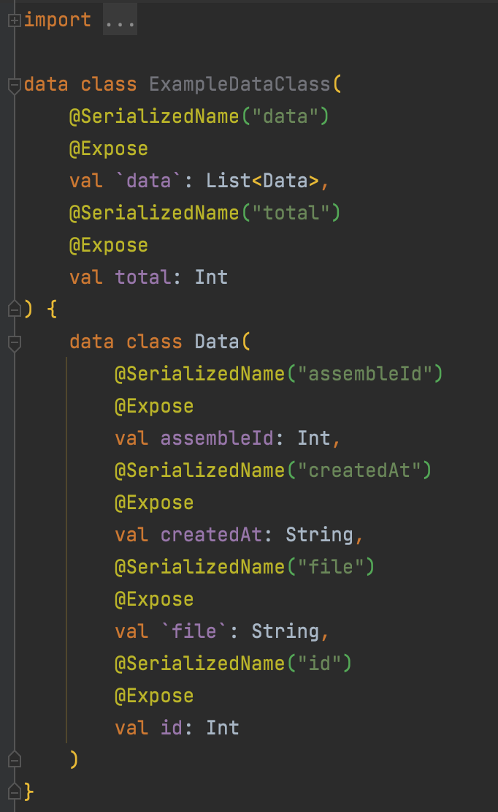

# 🔌 괜찮은 플러그인 소개!- JSON to kotlin data class


요점 : Swagger를 사용해서 일하다 보면 서버에서 내려주는 json 형태로 data class 를 생성해야 하는데 여간 귀찮은 일이 아니다. **json 형태만 복사해서 넣어주면 data class 로 만들어주는 플러그인이 있다!**


참고 : https://plugins.jetbrains.com/plugin/9960-json-to-kotlin-class-jsontokotlinclass-

(이것이다! 바로 사용하는 방법을 보자.)

1. 플러그인 install! (맥북 기준입니다!)

Command + , 을 눌러 Plugins 페이지로 가서 json to kotlin class를 검색 후 install!


(필자는 이미 install한 상태 / 또 install 후 android studio를 재실행 해야할 수 있음.)

2. 예시로 써있는 json 형태를 복사!

```kotlin
{
  "data": [
    {
      "id": 0,
      "assembleId": 0,
      "file": "string",
      "createdAt": "string"
    }
  ],
  "total": 0
}
```

(예시 👆🏻)

3. 파일을 생성할 곳에서 마우스 오른쪽 클릭 후 new에서 Kotlin data class file to JSON 을 클릭!


4. 예시를 붙여넣기 후 이름 선정 and Generate!


끝!

4-1. Advanced 페이지에서 세부사항 설정(필자 기준으로 설명!)


이렇게 하게 되면 아래와 같이 생성된다!



이렇게 하면 많은 시간을 절약해서 data class를 만들어낼 수 있다.


% 유의사항 %

- Double과 Float 과 같은 것들은 서버(node 기준)에서 number로 적혀있는 경우가 있기 때문에 인식이 안 될수 있으니 실제로 내려오는 데이터와 대조해서 int로 설정되어있는 double 변수들을 수정해줘야한다.
