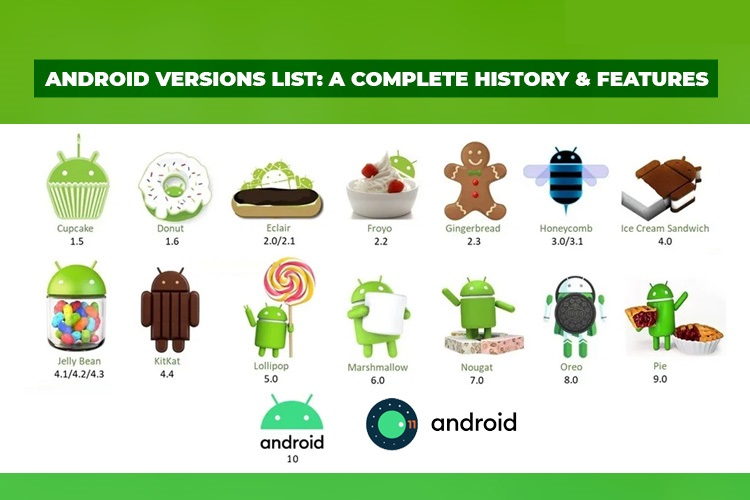

# 🧑🏻‍💻 안드로이드의 기본지식 - 1

필자가 안드로이드를 개발을 2020년에 시작해서 벌써 2022년이 되어 2년째 공부 및 현직에서 개발을 하고있다.

개발을 시작할 때 맨 처음 C언어로 배워 기본 컴퓨터에 쌓이는 메모리 스택과 코드는 어떻게 진행하고 동작하는지 배우고 나서 안드로이드 개발을 하니 생각보다 여러가지 편하게 개발을 할 수 있었고  툴을 사용하니 개발이 쉽고 내가 실제로 사용할 수 있다는 생각에 많은 기능들을 만들어보고 싶었다.

그래서 그냥 무작정 어떤 기능을 만들어보고 싶고 어떤 라이브러리를 써서 다채롭게 만들고 싶다는 욕망이 더 강해 기본을 익히는 것은 등한시 했던 날이 있었다.

그래서 반성하는 의미로 다시 기본을 잡고자 우리가 사용하고 개발하고 있는 안드로이드 앱의 기본 지식을 하나씩 정리해보도록 하겠다.

계속해서 안드로이드 앱 개발을 진행하는 나를 위함 또는 안드로이드 앱 개발을 시작하는 사람들을 위해서 이 글이 도움이 됐으면 좋겠다.

1. 안드로이드 란.

안드로이드란 "**android**" 라는 회사에서 개발한 모바일 운영체제이다. 원래 이 회사는 디지털 카메라의 OS(Operating System : 운영체제)를 개발하기 위한 회사였지만 휴대폰에 카메라를 점점 접목시키기 시작해 이에 발 맞춰 스마트폰 개발하는 회사가 된 것이다.

이에 2년만에 우리가 알고있는 Google(구글)에서 Android 회사를 인수하게 된 것이다. (갓구글)

안드로이드는 버전 관리를 최초에 알파벳 순서대로 과자를 본따 만들었지만 (아래 사진 참조) 10.0 버전 부터는 Android 10 이렇게 출시하고 있다. (저것도 나름 귀엽고 재밌는 소재로 기억된다.)

2. 안드로이드의 구성 요소

이 글부터는 처음 보는 분들은 어려울 수 있지만 안드로이드 기기를 사용하고 있다면 예를 곁들여서 설명을 덧붙여 보겠다.

| 구성요소                                | 설명                                                         | 예시                                                         |
| --------------------------------------- | :----------------------------------------------------------- | ------------------------------------------------------------ |
| 액티비티(activity)                      | 사용자가 눈으로 볼 수 있는 화면의 구성요소(버튼 누르기, 이미지 확대하기) | 그냥 우리가 앱을 보는 거의 모든 화면이라고 생각하면 편하다.  |
| 프래그먼트(fragment)                    | 액티비티 내에서 독자적으로 동작할 구 있는 화면 구성요소(한개의 액티비티 내에서 여러개의 프래그먼트를 보여주는 것이 가능 but 액티비티 안에서만 사용 가능.) | 배달의 민족에서 음식 카테고리가 위에 나뉘어져 있는데 그 아래 화면이라고 생각하면 된다. |
| 브로드캐스트 리시버(breadcast receiver) | 안드로이드 시스템에서 제공하는 정보를 수신하거나 특정정보를 수신 | 배터리부족, 언어 설정 변경, 알람, 전화 등 어떤 행위가 왔다는 알림을 받고 방송을 해주는 기능입니다. |
| 서비스(service)                         | 백그라운드에서 실행되는 구성요소                             | 예를 들어 음악을 재생하거나, 파일 입출력을 수행하거나 전화 앱을 켜놓지 않은 상태에서도 전화를 받을 수 있는 것이다 앱을 화면에서 직접 쓰고 있지 않아도 백그라운드에서 서비스가 돌아가고 있기 때문이다. |
| 콘텐트 프로바이더(content provider)     | 안드로이드 어플리케이션 간의 데이터 공유를 위해 표준화된 인터페이스를 제공 | 인스타그램에서 재미있는 글이 있는데 카카오톡으로 공유하고 싶다면 이 기능을 사용하는 것이다. 인스타 안에 정보를 카카오톡으로 데이터 공유! |
| 노티피케이션(notification)              | 사용자에게 특정 이벤트를 알림(상태바 내리면 표시되는 메세지들) | 앱에서 보내는 알림 기능이라고 보면 된다.                     |
| 인텐트(intent)                          | 안드로이드 구성요소에 다양한 정보를 전달하기 위한 객체       | 위에 액티비티, 서비스, 브로드캐스트 리시버, 컨텐트 프로바이더의 통신을 맡고 있는게 인텐트이다.(얘로 왔다 갔다) |
| 인텐트 필터(intent filter)              | 다양한 인텐트를 필터링하여 원하는 인텐트만 수신할 수 있도록 하는 구성요소 | 앱에서 나는 전화 왔을 때 화면이 까매져야해! 라고 한다면 전화가 왔다 라는 것만 인식해서 특정 기능을 실행 시킨다. |

여러가지를 함께 표 안에 넣었지만 안드로이드의 **4대 컴포넌트(Activity, Service, Broadcast Receiver, Content Provider)** 이렇게고 이 것들은 인텐트의 의해 활성화 됩니다.

3. 안드로이드 앱을 개발하려면

현재 안드로이드 스튜디오로 앱 개발을 할 수 있다.

https://developer.android.com/studio?gclid=Cj0KCQjwwfiaBhC7ARIsAGvcPe6GHnxD68R1EEQmx8fPswoD5Pghuepj-yFn5fsnWEU9KpSzAEvacgcaAhpREALw_wcB&gclsrc=aw.ds 

해당 링크로 가면 Mac, Window 상관없이 다운로드 받을 수 있다.(필자는 Window에서 하다가 Mac으로 넘어왔다.)
